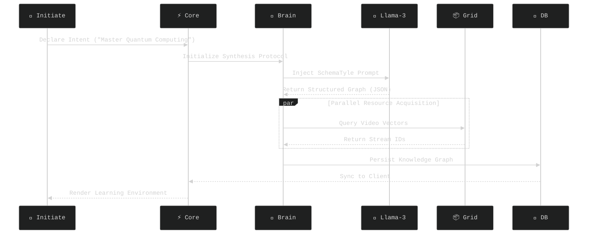
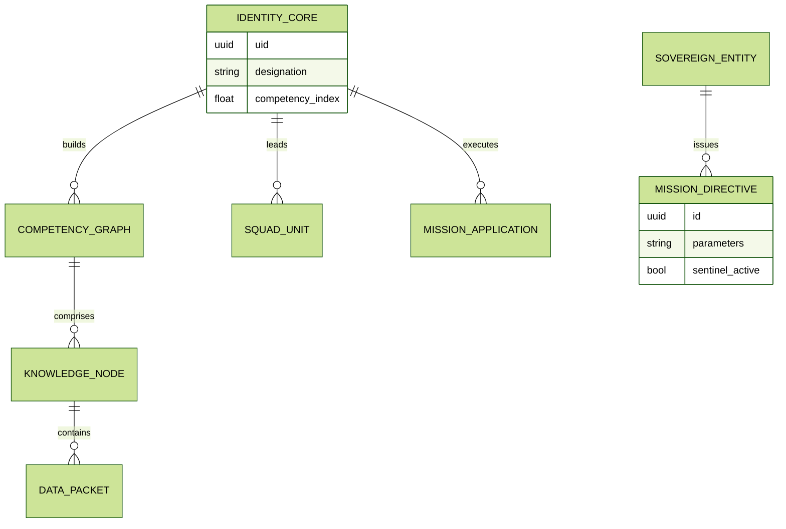

# SovreignyX - The Cognitive Architecture for Professional Sovereignty

<div align="center">

<div style="
    background: linear-gradient(135deg, #0f0c29 0%, #302b63 50%, #24243e 100%);
    padding: 50px;
    border-radius: 20px;
    box-shadow: 0 15px 35px rgba(0,0,0,0.6);
    border: 1px solid rgba(255,255,255,0.15);
    backdrop-filter: blur(10px);
">
  <!-- GLOWING TITLE -->
  <h1 style="
      color: #ffffff;
      font-family: 'Segoe UI', sans-serif;
      font-size: 4em;
      letter-spacing: 4px;
      margin: 0;
      text-transform: uppercase;
      text-shadow: 0 0 20px rgba(79, 172, 254, 0.6);
  ">
    Sovreigny<span style="color: #4facfe;">X</span>
  </h1>
  
  <p style="
      background: -webkit-linear-gradient(#eee, #333);
      -webkit-background-clip: text;
      color: #a0c4ff;
      font-size: 1.4em;
      font-weight: 300;
      margin-top: 20px;
      font-family: monospace;
  ">
    >> The Cognitive Architecture for Professional Sovereignty
  </p>
  
  <br />
  
  <!-- TECH PILLARS -->
  <div style="display: flex; justify-content: center; gap: 10px; flex-wrap: wrap;">
    <a href="https://flutter.dev"></a>
    <a href="https://supabase.com"></a>
    <a href="https://www.python.org"></a>
    <a href="https://groq.com"></a>
  </div>
</div>

<br />

<!-- COMMAND DECK (High Contrast) -->
<h3 style="color: #4facfe;">🔻 MISSION CONTROL 🔻</h3>
<p>
  <a href="#scion">
    
  </a>
  &nbsp;&nbsp;
  <a href="#sovereign">
    
  </a>
  &nbsp;&nbsp;
  <a href="#neural">
    
  </a>
  &nbsp;&nbsp;
  <a href="#deploy">
    
  </a>
</p>

</div>

---
---
<h1>Youtube Demo Url: https://youtu.be/R-aX6DdpwdA</h1>

### 🔐 Quick-Access Test Credentials
Use these pre-configured accounts to instantly access the full feature set without onboarding.

| Application | Role | Email | Password |
| :--- | :--- | :--- | :--- |
| **⚔️ Scion** | Student | `edooo51492209@gmail.com` | `123456` |
| **🏰 Sovereign** | Company | `dammuvinay143@gmail.com` | `123456` |
<div id="paradigm"></div>

## 🔮 The Paradigm Shift: Why SovreignyX?

Traditional education platforms (LMS) and recruitment tools operate in silos. A student learns on one platform, and a company recruits on another, relying on static resumes that fail to capture true competency.

**SovreignyX** bridges this gap by creating a single, unified ecosystem:
1.  **Dynamic Learning**: Instead of static courses, users generate bespoke curriculums using AI, tailored to *exactly* what the market needs.
2.  **Verifiable Sovereignty**: Every skill mastered and project built in the **Scion** node is instantly verifiable by organizations in the **Sovereign** node.
3.  **Real-Time Recruitment**: Companies don't just "post jobs"; they monitor the talent pool in real-time, identifying high-performers before they even apply.

It is a **Cognitive Architecture** where learning directly translates to professional sovereignty.

---

<div id="scion"></div>

## ⚔️ **Scion**: The Knowledge Forge

> *"Inherit the Code. Architect the Future."*

**Scion** is the "Student Node" of the ecosystem. It is designed for learners who want to master skills rapidly and build a verifiable portfolio.

### 💎 Scion Feature Matrix
*   **🤖 AI Neural Chat**: Context-aware academic assistant powered by Llama-3.
*   **🕸️ Web Page Generator**: Generate functional HTML/CSS websites from a single prompt.
*   **📚 Dynamic Course Synthesis**: AI generates complete curriculums (Curriculum -> Modules -> Lessons -> YouTube Streams).
*   **🧠 Daily Neuro-Tasks**:
    *   **Quiz**: Daily knowledge checks.
    *   **Code Challenge**: IDE-based coding puzzles.
    *   **Brain Game**: Logic word puzzles.
*   **📱 Reels Learning**: High-density educational short-video feed.
*   **🏆 Gamification**: Leaderboards, XP, Streaks, and Achievements.
*   **🤝 Collaborative Units**: Form squads to build projects with real-time chat.
*   **💼 Job Board**: Apply for missions posted by Sovereign companies.
*   **📧 Email Integration**: Receive notifications for interviews and application status.

          "To AVAIL THIS FEATURES CLICK ON THREE DOTS PRESENT IN THE APP DASHBOARD"


### 🧩 How It Works for Students
*   **Step 1: Declare Intent**: You simply type "I want to learn Quantum Computing".
*   **Step 2: AI Synthesis**: The **Llama-3 Engine** constructs a structured 4-week curriculum, complete with YouTube video streams, reading materials, and milestones.
*   **Step 3: Consume**: You watch "Course Reels"—short, high-density educational videos—to visually grasp concepts.
*   **Step 4: Collaborate**: You form a "Squd Unit" (Team) with 3 other peers to build a capstone project.

### 📡 Technical Flow: Dynamic Curriculum Synthesis
*The following diagram illustrates how the system builds a course from zero.*

1.  **User Input**: The topic string is sent to the backend.
2.  **Prompt Engineering**: We wrap the topic in a strict JSON schema prompt for Llama-3.
3.  **Parallel Fetching**: While the text curriculum loads, we asynchronously query YouTube APIs for video content.
4.  **Persistence**: The final graph is saved to Supabase, making it shareable.



---

<div id="sovereign"></div>

## 🏰 **Sovereign**: Strategic Command

> *"Define the Standard. Claim the Talent."*

**Sovereign** is the "Company Node". It is used by organizations to ensure integrity in the hiring process and access the talent pool cultivated in Scion.

### 💎 Sovereign Feature Matrix
*   **👁️ Sentinel Proctoring**: AI-powered anti-cheat system for remote assessments (Face Detection, Focus Tracking).
*   **📡 Talent Radar**: Real-time discovery of top-performing students.
*   **📝 Mission Control**: Create job posts and attach custom assessments.
*   **🎯 Applicant Tracking**: Move candidates through stages (Applied -> Screening -> Interview -> Offer).
*   **💬 Direct Comms**: Cross-platform messaging with students.

### 🧩 How It Works for Companies
*   **Step 1: Surveillance**: Companies browse the "Talent Radar" to see top performing students in specific niches (e.g., "Top 5% in Flutter").
*   **Step 2: Deployment**: Recruiters launch a "Mission" (Job Post) with linked assessments.
*   **Step 3: Verification**: When an applicant takes a test, the **Sentinel System** monitors their camera and browser focus to prevent cheating.
*   **Step 4: Acquisition**: Verified results are pushed instantly to the recruiter's dashboard.

### 🛰️ Technical Flow: Sentinel Proctoring
*This flow ensures the integrity of remote assessments.*

1.  **Secure Zone**: The app locks the UI, preventing navigation away from the test.
2.  **Telemetry**: The front camera stream is analyzed locally for face presence.
3.  **Violation Logic**: If the user alt-tabs or leaves the frame, an event is logged.

```mermaid
%%{init: {'theme': 'base', 'themeVariables': { 'darkMode': true, 'primaryColor': '#800000', 'secondaryColor': '#330000', 'tertiaryColor': '#110000' }}}%%
sequenceDiagram
    participant Candidate as 🎯 Subject
    participant Device_Sensors as 📷 Input
    participant Scion_Client as 📱 Terminal
    participant Sentinel_AI as 👁️ Sentinel
    participant Sovereign_Command as 🏢 HQ

    Sovereign_Command->>Scion_Client: Deploy Assessment Protocol
    Scion_Client->>Candidate: Initialize Environment
    
    rect rgb(30, 0, 0)
        note right of Candidate: SECURE ZONE ACTIVE
        Scion_Client->>Device_Sensors: Lock Focus
        Device_Sensors-->>Sentinel_AI: Stream Visual Telemetry
        
        opt Violation Detected
            Sentinel_AI->>Scion_Client: Trigger Warning
            Scion_Client->>Sovereign_Command: Log Incident Event
        end
    end
    
    Candidate->>Scion_Client: Submit Data
    Scion_Client->>Sovereign_Command: Transmit Verified Result
```



---

<div id="neural"></div>

## 🧬 Neural Architecture (System Design)

The ecosystem is built as a **Modular Micro-Service Topology**. 
-   **Flutter** handles the UI/UX on edge devices (Mobile/Web).
-   **Django** acts as the orchestrator for heavy compute (AI Logic).
-   **Supabase** acts as the central nervous system, pushing state changes to all connected clients instantly.

### 💾 Data Topology (ERD)

<details>
<summary><b>View Data Schema</b></summary>



</details>

### 🗺️ Directory Map

```text
SovreignyX/
├── 🌑 Scion/                      # The Student Application (Knowledge Forge)
│   ├── lib/services/              # Logic Layer (Auth, AI, Team)
│   ├── lib/screens/               # UI Layer (Reels, Courses)
│   └── pubspec.yaml               # Dependencies
│
├── 🌕 Sovereign/                  # The Company Application (Company Command Node)
│   ├── lib/screens/               # Proctoring & Guard UI
│   └── pubspec.yaml               # Dependencies
│
└── 🪐 Core Infrastructure/
    ├── 🐍 backend/                # Python/Django (AI Orchestrator)
    └── ⚡ supabase/               # SQL Migrations (Database)
```

---

<div id="deploy"></div>

## 🚀 Deployment & Testing Protocol

**Follow these steps exactly to run the application on your local machine and mobile devices.**


### 📋 Prerequisites
*   **Flutter SDK**: `3.7.2` or higher (Run `flutter doctor` to verify).
*   **Python**: `3.8+` for the backend services.
*   **Supabase Project**: A valid project URL and Anon Key.
*   **Android Emulator or Physical Device**: Enabled in Developer Mode.


### 🔷 Phase 1: Backend Initialization (The AI Core)
The backend handles the AI logic and MUST be running first.
```bash
cd backend
pip install -r requirements.txt
# IMPORTANT: Use 0.0.0.0 to expose the server to your network
python manage.py runserver 0.0.0.0:8000
```
*Keep this terminal window OPEN.*


### 🔷 Phase 2: Mobile Configuration (Critical for Testing)
To test on mobile, the app needs to know where your backend is running.

**Option A: Android Emulator (Easiest)**
*   No changes needed. The app uses `10.0.2.2:8000` by default.

**Option B: Physical Device (Test on Real Phone)**
1.  Find your computer's IP (Windows: `ipconfig`, Mac/Linux: `ifconfig`).
2.  Update `config_service.dart` in both apps:
    *   Change `http://10.0.2.2:8000` to `http://YOUR_IP_ADDRESS:8000`.
3.  Ensure phone and PC are on the same WiFi.


### 🔷 Phase 3: Client Activation
Launch the applications in separate terminals.

**⚔️ Scion (Student App)**
```bash
cd Scion
flutter pub get
flutter run --release
```

**🏰 Sovereign (Company App)**
```bash
cd Sovereign
flutter pub get
flutter run --release
```

### 🔑 Intelligence Access Protocol

<div style="border: 2px solid #ff4b4b; border-radius: 10px; background: rgba(50, 0, 0, 0.3); padding: 20px;">
  <h4 style="color: #ff4b4b; margin-top: 0;">⚠️ RESTRICTED AREA: API KEY CONFIGURATION REQUIRED</h4>
  <p>The neural networks powering SovreignyX (AI Services) require valid authentication tokens. For security, these keys are <b>not</b> included in the repository.</p>
</div>

<br/>

#### 📋 Authorization Status

| Service Node | Provider | Purpose | Action Required |
| :--- | :--- | :--- | :--- |
| **Llama-3 Engine** | [Groq Console](https://console.groq.com) | Curriculum Synthesis & Chat | **MANDATORY** |
| **Grok Agent** | [xAI Platform](https://x.ai) | Advanced Reasoning (Optional) | *OPTIONAL* |

<br/>

#### 🛠️ Manual Configuration Protocols

##### 📱 NODE: SCION (Student App)

Open `Scion/lib/utils/constants.dart` and locate the `AppConstants` class.

| Line | Protocol |
| :--- | :--- |
| `8` | Replace `YOUR_GROQ_API_KEY` |
| `10` | Replace `YOUR_XAI_API_KEY` |

```dart
// ❌ BEFORE (System Offline)
static const String groqApiKey = 'YOUR_GROQ_API_KEY';

// ✅ AFTER (System Online)
static const String groqApiKey = 'gsk_8hT...'; // Paste actual key
```

Also verify `Scion/lib/services/daily_task_service.dart`.

<br/>

##### 🏰 NODE: SOVEREIGN (Company App)

Configure the following services to enable company intelligence:

1.  **AI Course Service**: `Sovereign/lib/services/ai_course_service.dart` (Line 5)
2.  **Recruitment Logic**: `Sovereign/lib/services/ai_recruitment_service.dart` (Line 6)
3.  **Company Core**: `Sovereign/lib/services/company_service.dart` (Line 136)

<br/>

##### 🐍 CORE: BACKEND (Django Orchestrator)

The backend engine requires direct key injection in Python files.
*Locate and update `GROQ_API_KEY` in:*

*   `code_executor_service/code_executor/settings.py` (Line 166)
*   `code_executor_service/execution/prompt_generator_views.py` (Line 22+)
*   `code_executor_service/execution/web_generator_views.py` (Line 137)

```python
# ❌ BEFORE
GROQ_API_KEY = 'YOUR_GROQ_API_KEY'

# ✅ AFTER
GROQ_API_KEY = 'gsk_abc123xyz...'
```

---

<div align="center">
<br />

**Architected by SovreignyX Systems**  
*Est. 2025 | Open Source Protocol*

[🐛 Report Issue](issues) · [💡 Request Feature](pulls)

</div>

<!-- Horizontal PNG Gallery -->
<div style="display: flex; justify-content: Left; gap: 25px; flex-wrap: wrap;">
    <h3>Scion Dashboard</h3>
  
    
  
  
</div>
